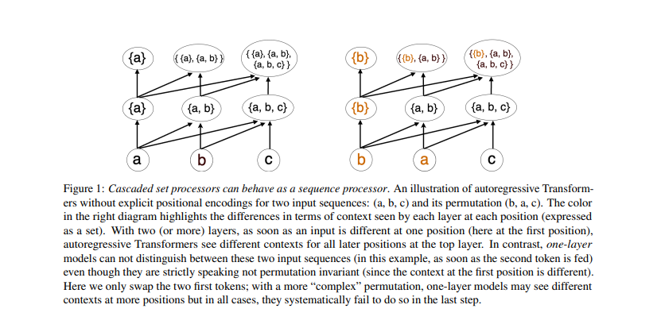
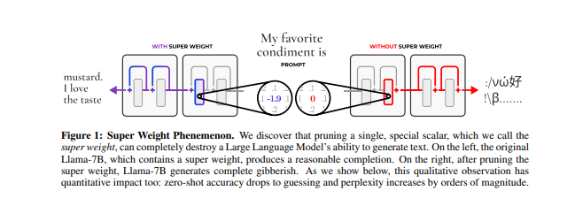

# Super-transformers
> **Important**  
> This is not a formal implementation of the referenced papers. Instead, it's a simple experiment to explore these new ideas and test them out for fun.


We code a GPT2 transformers  but instead we use these three new ideas: 

- Scalable softmax
- Try to train it without the positional encodings
- super weights for pruning during inference

## Scalable Softmax 

In traditional decoder-only Transformers, a major bottleneck comes from the quadratic growth of attention computations, which leads to attention fading—where softmax struggles to distinguish relevant tokens as sequence lengths increase.

This paper highlights the weaknesses of the original softmax, showing how it performs poorly in large-scale settings. Scalable Softmax (SSMax) introduces a new way to scale the logits before applying softmax, making attention computations more efficient and preventing the loss of crucial information in longer sequences.

#### Standard Softmax:
$$
\text{Softmax}(x_i) = \frac{e^{x_i}}{\sum_{j} e^{x_j}}
$$

#### Scalable Softmax (SSMax):

$$
\text{SSMax}(z_i) = \frac{e^{(s \log n)z_i}}{\sum_{j=1}^{n} e^{(s \log n)z_j}}
$$

where:
-  s is the scaling factor,
-  n  is the input size.

#### SSMax in Attention Mechanisms:
$$
a_n = \text{SSMax} \left( \frac{q_n K^T}{\sqrt{d}} \right) = \text{Softmax} \left( \frac{(s \log n) q_n K^T}{\sqrt{d}} \right)
$$

where:
- q_n  and  K  are the query and key matrices in attention,
- d  is the hidden dimension.


## Training without Positional Encodings

<p align="center">
  
</p>

## Super Weights 
<p align="center">
  
</p>


### Citations

```bash
@inproceedings{Nakanishi2025ScalableSoftmax,
    title   = {Scalable-Softmax Is Superior for Attention},
    author  = {Ken M. Nakanishi},
    year    = {2025},
    url     = {https://arxiv.org/pdf/2501.19399}
}
```

```bash
@article{Irie2024WhyAP,
    title   = {Why Are Positional Encodings Nonessential for Deep Autoregressive Transformers? Revisiting a Petroglyph},
    author  = {Kazuki Irie},
    year    = {2024},
    url     = {https://arxiv.org/pdf/2501.00659}
}
```

```bash
@article{Yu2024TheSW,
    title   = {The Super Weight in Large Language Models},
    author  = {Mengxia Yu and De Wang and Qi Shan and Colorado Reed and Alvin Wan},
    year    = {2024},
    url     = {https://arxiv.org/pdf/2411.07191v1}
}
```
