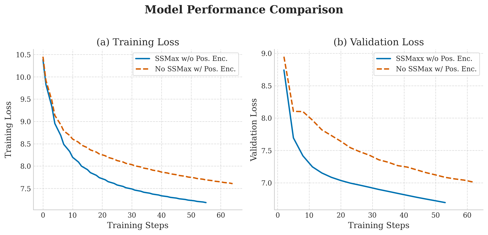

# Super-transformers
> **Important**  
> This is not a formal implementation of the referenced papers. Instead, it's a simple experiment to explore these new ideas and test them out for fun.


## Overview
Super-transformers is an experimental implementation that explores modifications to the standard GPT-2 transformer architecture. This project combines three key architectural innovations:

- Scalable Softmax: Implementation of a modified attention mechanism using scalable softmax to improve computational efficiency and potentially enhance model performance on longer sequences.

- Positional Encoding Ablation: Exploring the model's capability to learn without explicit positional encodings, investigating whether contextual information alone is sufficient for sequence modeling.

- Super Weights for Pruning: Implementing dynamic weight pruning mechanisms that can be applied during inference time to reduce computational overhead without significant performance degradation.


## Experimental Results
Our preliminary experiments compare training and validation loss between:

- A model using scalable softmax without positional encodings
- A model using standard softmax with positional encodings

<p align="center">
  
</p>

<p align="center">
  <em>Figure 1: Comparison of training and validation losses between different architectural configurations.</em>
</p>

## Getting Started
```bash
git clone  https://github.com/dame-cell/Super-transformers.git
cd Super-transformers
pip install -r requirements.txt 
cd src
```

## Dataset
This project uses the [fineweb-small](https://huggingface.co/datasets/eliplutchok/fineweb-small-sample) dataset from Hugging Face. The preprocessing script handles downloading and preparing the data.


```bash
python3 data.py \
    --max_length 1024 \
    --sample_size 100000 \
    --data_name eliplutchok/fineweb-small-sample \
    --stride 256 \
    --split_ratio 0.9 \
    --batch_size 1000 \
    --output_dir .

```
## Training 

```bash 
python3 train.py \
    --train_data path_to_train_data \
    --test_data path_to_test_data \
    --size default \
    --ssmax True \
    --use_pos_enc False \
    --wandb False \
    --batch_size 6 \
    --generating_step 2000 \
    --validation_step 1000 \
    --save_model 1000 \
    --max_len 1024 \
    --epoch 1 \
    --lr 5e-5 \
    --vocab_size 50257
```


### Citations

```bash
@inproceedings{Nakanishi2025ScalableSoftmax,
    title   = {Scalable-Softmax Is Superior for Attention},
    author  = {Ken M. Nakanishi},
    year    = {2025},
    url     = {https://arxiv.org/pdf/2501.19399}
}
```

```bash
@article{Irie2024WhyAP,
    title   = {Why Are Positional Encodings Nonessential for Deep Autoregressive Transformers? Revisiting a Petroglyph},
    author  = {Kazuki Irie},
    year    = {2024},
    url     = {https://arxiv.org/pdf/2501.00659}
}
```

```bash
@article{Yu2024TheSW,
    title   = {The Super Weight in Large Language Models},
    author  = {Mengxia Yu and De Wang and Qi Shan and Colorado Reed and Alvin Wan},
    year    = {2024},
    url     = {https://arxiv.org/pdf/2411.07191v1}
}
```
