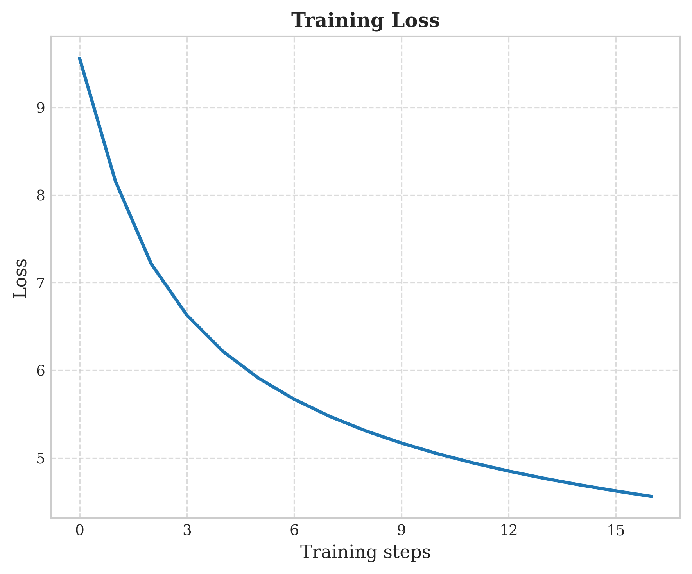

# Super-transformers
> **Important**  
> This is not a formal implementation of the referenced papers. Instead, it's a simple experiment to explore these new ideas and test them out for fun.


## Overview
This repository explores experimental modifications to the standard transformer architecture through two distinct yet complementary projects: Super-Transformers and MiniDeepSeek

### Super-transformers
- Scalable Softmax: Implementation of a modified attention mechanism using scalable softmax to improve computational efficiency and potentially enhance model performance on longer sequences.

- Positional Encoding Ablation: Exploring the model's capability to learn without explicit positional encodings, investigating whether contextual information alone is sufficient for sequence modeling.

### MiniDeepSeek 

- Multi-Latent Attention (MLA) represents a fundamental rethinking of attention computation. Rather than computing attention in a single high-dimensional space, MLA projects queries and keys into multiple lower-dimensional latent spaces. This approach allows the model to capture different aspects of information in parallel while substantially reducing computational demands. The beauty of MLA lies in its ability to maintain representational power while decreasing the FLOPs required for attention computation, often achieving up to 4x efficiency improvements depending on implementation details.

- KV Cache Optimization addresses a core inefficiency in autoregressive text generation. During inference, standard transformer models repeatedly compute key and value tensors for the entire sequence with each new token. The KV cache optimization stores these previously computed tensors, enabling the model to reuse them rather than recalculating. This becomes increasingly valuable as sequence length grows, as only the newest token requires fresh computation while previous context is efficiently retrieved from cache. This optimization dramatically reduces the computational cost of generation after the first token, making real-time text generation feasible even on constrained hardware.

- Weight Absorption Technique focuses on computational graph optimization. This technique fuses multiple sequential matrix multiplications into fewer operations by pre-computing their combined effect. For instance, in transformer architectures, multiple linear projections can be collapsed into unified transformation matrices during inference. This absorption not only reduces the total number of operations but also eliminates intermediate activations, reducing memory transfers that often bottleneck performance. When properly implemented, weight absorption can provide a 15-30% speedup with minimal code changes, particularly when leveraged alongside static computational graphs.


## Experimental Results
Our preliminary experiments compare training and validation loss between:

- A model using scalable softmax without positional encodings
- A model using standard softmax with positional encodings

<p align="center">
  
</p>

<p align="center">
  <em>Figure 1: Comparison of training and validation losses between different architectural configurations.</em>
</p>

We trained the MiniDeepseek architecture on a curated subset of the TinyStories dataset from Huggingface. The training process consisted of a single epoch, requiring approximately 12 hours of computational time on our hardware configuration.

Train loss             |  Val loss
:-------------------------:|:-------------------------:
 | 
<p align="center">
  <em>Figure 1: Comparison of training and validation losses.</em>
</p>

### Inference Optimization Results

<p align="center">
  
</p>

Our benchmarking demonstrates significant performance improvements through combining weight absorption and KV caching optimizations in the DeepSeek Mini model.

Performance Highlights
Total Generation Time: The fully optimized model achieves a 70% reduction (from ~1.0s to ~0.3s), with KV caching and weight absorption independently providing 45% and 60% improvements respectively.

- Per-Token Speed: Processing time decreases from 10-11ms (baseline) to 7.5ms (fully optimized), representing a 30% speedup that enhances generation fluency.

- First Token Latency: Most dramatically, initial response time drops by 90%—from 100-200ms to just 10ms—significantly improving perceived responsiveness.

- Processing Stability: Optimized variants show markedly reduced variance in token generation times, with the fully optimized model maintaining consistent ~7ms processing regardless of sequence length.
Impact

These optimizations work synergistically, delivering a combined 3× speedup that transforms  MiniDeepseek into a highly responsive system suitable for latency-sensitive applications. The multiplicative effect of these techniques enables efficient deployment even on hardware with limited computational resources, making real-time text generation practical for a wider range of applications.


## Getting Started
```bash
git clone  https://github.com/dame-cell/Super-transformers.git
cd Super-transformers
pip install -r requirements.txt 
cd src
```

## Dataset
This project uses the [fineweb-small](https://huggingface.co/datasets/eliplutchok/fineweb-small-sample) dataset from Hugging Face. The preprocessing script handles downloading and preparing the data.


```bash
python3 data.py \
    --max_length 1024 \
    --sample_size 100000 \
    --data_name eliplutchok/fineweb-small-sample \
    --stride 256 \
    --split_ratio 0.9 \
    --batch_size 1000 \
    --output_dir .

```
## Training 

For training the GPT2 architecture: 
```bash 
python3 train.py \
    --train_data path_to_train_data \
    --test_data path_to_test_data \
    --size small \
    --ssmax True \
    --use_pos_enc False \
    --wandb False \
    --batch_size 2 \
    --generating_step 2000 \
    --validation_step 1000 \
    --save_model 1000 \
    --epoch 1 \
```

For training the MiniDeepseek architecture: 
```bash 
python3 train_deepseek.py \
    --train_data path_to_train_data \
    --test_data path_to_test_data \
    --size small \
    --ssmax  \
    --wandb  \
    --log_interval 1000 \ 
    --validation_step 1000 \ 
    --generate 5000 \ 
    --batch_size 20 \  
    --max_seq_len 512 \  
```


## Models 

> **Warning**  
> Please note that the model was only trained on 100k rows for a single epoch, so its generation quality may be limited.

You can find the Pretrained Models here: 
| **Model**             | **Link**                               |
|---------------------------|-----------------------------------------|
| Deepseek Model                      | [Model](https://huggingface.co/damerajee/super-transformers-model/blob/main/best_model.pth) 


### Citations

```bash
@inproceedings{Nakanishi2025ScalableSoftmax,
    title   = {Scalable-Softmax Is Superior for Attention},
    author  = {Ken M. Nakanishi},
    year    = {2025},
    url     = {https://arxiv.org/pdf/2501.19399}
}
```

```bash
@article{Irie2024WhyAP,
    title   = {Why Are Positional Encodings Nonessential for Deep Autoregressive Transformers? Revisiting a Petroglyph},
    author  = {Kazuki Irie},
    year    = {2024},
    url     = {https://arxiv.org/pdf/2501.00659}
}
```

```bash
@article{Yu2024TheSW,
    title   = {The Super Weight in Large Language Models},
    author  = {Mengxia Yu and De Wang and Qi Shan and Colorado Reed and Alvin Wan},
    year    = {2024},
    url     = {https://arxiv.org/pdf/2411.07191v1}
}
```

```bash
@techreport{DeepSeek2025V3,
    title   = {DeepSeek-V3 Technical Report},
    author  = {DeepSeek-AI},
    year    = {2025},
    month   = {Feb},
    url     = {https://arxiv.org/pdf/2412.19437},
    institution = {DeepSeek-AI},
    note    = {https://arxiv.org/pdf/2412.19437}
}

```